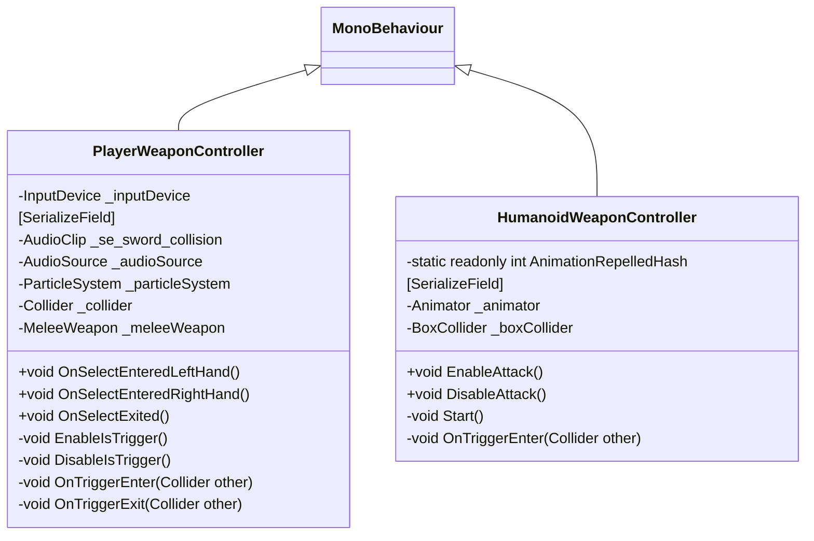

```mermaid
classDiagram
    MonoBehaviour <|-- PlayerWeaponController
    class PlayerWeaponController{
        -InputDevice _inputDevice
        [SerializeField]
        -AudioClip _se_sword_collision
        -AudioSource _audioSource
        -ParticleSystem _particleSystem
        -Collider _collider
        -MeleeWeapon _meleeWeapon

        +void OnSelectEnteredLeftHand()
        +void OnSelectEnteredRightHand()
        +void OnSelectExited()
        -void EnableIsTrigger()
        -void DisableIsTrigger()
        -void OnTriggerEnter(Collider other)
        -void OnTriggerExit(Collider other)
    }
    MonoBehaviour <|-- HumanoidWeaponController
    class HumanoidWeaponController{
        -static readonly int AnimationRepelledHash
        [SerializeField]
        -Animator _animator
        -BoxCollider _boxCollider

        +void EnableAttack()
        +void DisableAttack()
        
        -void Start()
        -void OnTriggerEnter(Collider other)
    }
```